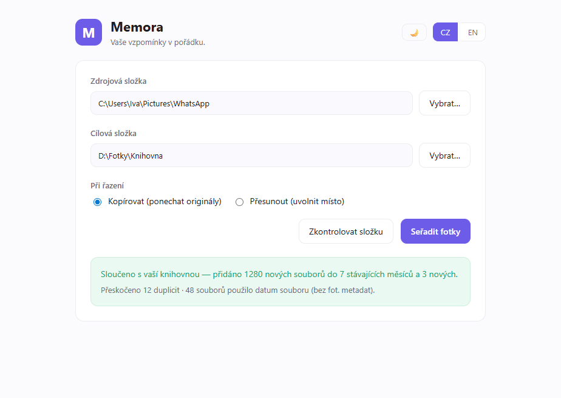

# Memora

Sort thousands of photos and videos into tidy `YYYY/YYYY-MM` folders by their
metadata — locally, privately, bilingually (Czech / English).

**Tagline:** Your memories, in order. / Vaše vzpomínky popořadě.



## For users

You don't need any of the below — just download the installer from the
[releases page](https://github.com/ifischerova/memora/releases/latest) or the
[promo site](https://ifischerova.github.io/memora/), run it, and follow
[the manual](MANUAL.md).

## Develop & build (Windows)

Requirements: Node.js ≥ 20.

> **macOS and Linux builds** are produced automatically by the release CI workflow (`.github/workflows/release.yml`), which runs on Windows, macOS, and Ubuntu runners in parallel. A `.dmg`, `.deb`, or `AppImage` cannot be built on Windows — push a `v*` tag to trigger the workflow and it attaches the `.exe`, `.dmg`, `.deb`, and `.AppImage` to the GitHub Release. The Linux `.deb` installs on Debian, Ubuntu, and Mint; the `AppImage` runs on virtually any distribution (Fedora, Arch, openSUSE, …) without installation.

```bash
npm install        # install dependencies
npm test           # run the unit test suite (node --test)
npm start          # run the app in development
npm run build      # produce dist/Memora-Setup-<version>.exe (+ portable)
```

### Publishing a release

1. Bump `version` in `package.json`.
2. `npm run build` → artifacts appear in `dist/`.
3. `npm run checksum` → copy the printed SHA-256 lines.
4. Create a GitHub Release and upload `dist/Memora-Setup-<version>.exe`.
   Also upload a copy named `Memora-Setup.exe` so the promo site's
   "latest" download link resolves. Optionally upload the portable build.
5. Paste the SHA-256 checksums into the release notes so users can verify
   their download.

> The easiest path is to **push a `v*` tag** instead of building by hand: the
> CI builds all platforms and attaches the artifacts to the Release
> automatically. It also adds versionless copies — `Memora-Setup.exe`,
> `Memora.deb`, `Memora.AppImage` — that the promo site's Windows and Linux
> download buttons link to. The macOS button points at the release page instead,
> because the `.dmg` ships as separate Intel (`x64`) and Apple Silicon (`arm64`)
> builds. The CI also generates and attaches `SHA256SUMS-<OS>.txt` for every
> platform, so users can verify their download with `sha256sum -c` (Linux/macOS)
> or `Get-FileHash` (Windows) — no manual checksum step required.

### A note on code signing

The installer is **not** code-signed, so Windows SmartScreen shows a "Windows
protected your PC" prompt on first run (users click **More info → Run anyway**),
and macOS Gatekeeper requires a right-click → **Open** the first time. This is
expected for an unsigned app and is documented for users in
[the manual](MANUAL.md). Until the app is signed, the published
`SHA256SUMS-<OS>.txt` files are the way for users to verify a download is intact
and matches what CI built.

**Free / low-cost signing options (no paid OV/EV cert):**

- **Windows — [SignPath Foundation](https://about.signpath.io/product/open-source)**:
  free code-signing certificates for open-source projects, integrable into the
  release CI. This is the main genuinely-free path that satisfies SmartScreen.
- **Windows — [Azure Trusted Signing](https://learn.microsoft.com/azure/trusted-signing/)**:
  very cheap (~$10/month) rather than free, and needs a verified identity, but
  far cheaper than a traditional OV/EV certificate.
- **Windows — self-signed certificate**: free but does **not** help SmartScreen
  (users would have to manually install/trust the cert), so it isn't useful for
  public distribution.
- **macOS**: Developer ID signing + notarization requires the Apple Developer
  Program (**$99/year**) — there is no free notarization path. Unsigned `.dmg`
  builds still run via right-click → Open.
- **Linux**: `.deb` and `AppImage` can be **GPG-signed for free** with your own
  key; publish the public key so users can verify. Checksums + GitHub Releases
  are the common baseline and are already in place.

The Microsoft Store is another trusted distribution path for Windows.

## Project layout

- `src/core/` — pure, unit-tested logic (date resolution, scanning, sorting).
- `src/main.js`, `src/preload.js` — Electron shell + IPC.
- `src/renderer/` — the UI.
- `site/` — promo site (auto-deployed to GitHub Pages via `.github/workflows/pages.yml`).
- `test/` — `node --test` suites.

## License

MIT © 2026 Iva Fischerova
